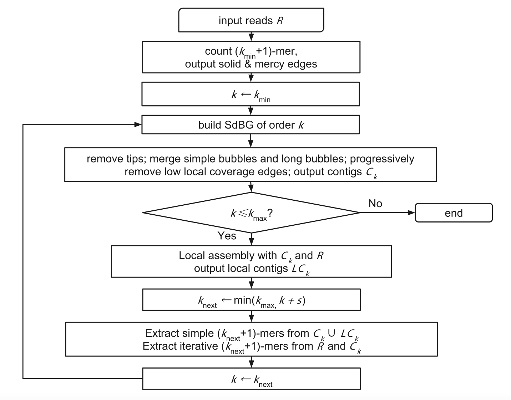

# 主组装 `src/main_assemble.cpp`
- 参数解析 `ParseAsmOption()`
- 读入sdbg `dbg.LoadFromFile()`
- 设置cpu线程数、tip长度、最小深度
- 移除tips `sdbg_pruning::RemoveTips(dbg, opt.max_tip_len)`
- 生成unitig图 `UnitigGraph graph(&dbg)`
- 清理图
    - 移除bubbles `naiver_bubble_remover.PopBubbles()` `complex_bubble_remover.PopBubbles()`
    - 断开弱连接 `DisconnectWeakLinks()`
    - 剪枝 `RemoveLowDepth()`
- 输出重叠群 `contig_writer()`

